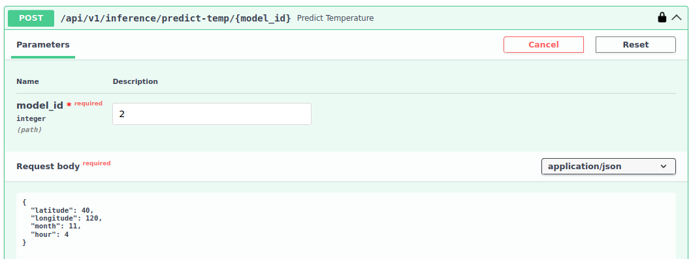
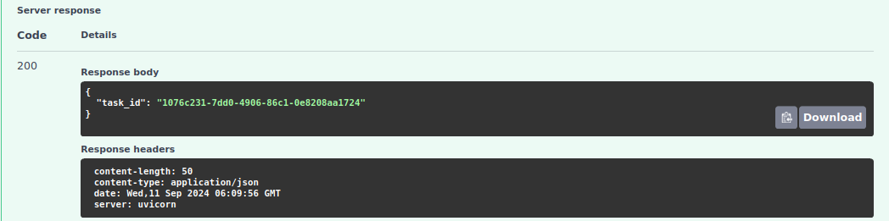

# Api base model for machine learning with FastAPI

A template app for async machine learning inference, with built-in user management, service access policies, monitoring and loaded with various dev tools.


## Table of Contents

- [Api base model for machine learning with FastAPI](#api-base-model-for-machine-learning-with-fastapi)
  - [Table of Contents](#table-of-contents)
  - [Presentation](#presentation)
    - [Features](#features)
    - [Project Structure](#project-structure)
  - [Installation](#installation)
    - [Prerequisites](#prerequisites)
    - [1. Install python dependencies](#1-install-python-dependencies)
    - [2. Generate a `.env` file](#2-generate-a-env-file)
    - [3. Build images](#3-build-images)
    - [4. Build a docker compose from template and make a first run](#4-build-a-docker-compose-from-template-and-make-a-first-run)
    - [5. Stop and restart the services](#5-stop-and-restart-the-services)
    - [Optional](#optional)
      - [Launch Prometheus / Grafana monitoring services](#launch-prometheus--grafana-monitoring-services)
  - [Development](#development)
    - [1. Setting up the database](#1-setting-up-the-database)
      - [Initialize async alembic migrations](#initialize-async-alembic-migrations)
      - [Generate the PGAdmin config file to register the DB](#generate-the-pgadmin-config-file-to-register-the-db)
    - [2. Populate the database](#2-populate-the-database)
      - [Add a first user in the DB and make it superuser](#add-a-first-user-in-the-db-and-make-it-superuser)
      - [Grant service access to a model](#grant-service-access-to-a-model)
    - [3. Test the inference service](#3-test-the-inference-service)
      - [Send a request](#send-a-request)
      - [Use the `task_id` to get your response](#use-the-task_id-to-get-your-response)
    - [4. Add new ML models](#4-add-new-ml-models)
      - [Adding new imports](#adding-new-imports)
      - [Adding the model class](#adding-the-model-class)
      - [Registering the model](#registering-the-model)
      - [Adding a model input schema](#adding-a-model-input-schema)
      - [Creating a request endpoint](#creating-a-request-endpoint)
  - [Dev Tools](#dev-tools)
    - [Linting and pre-commit](#linting-and-pre-commit)
    - [Tests](#tests)
  - [Monitoring (#WIP)](#monitoring-wip)
    - [Start / Stop services](#start--stop-services)
    - [Prometheus](#prometheus)
    - [Grafana](#grafana)
  - [What comes next?](#what-comes-next)
    - [Implement CI](#implement-ci)
    - [Create a simple HTMX Frontend](#create-a-simple-htmx-frontend)


---
## Presentation

### Features

- FastAPI async web application (separated request and response endpoints)
- User authentication and management using FastAPI-Users
- Async task processing with Celery
- PostgreSQL DB with async SQLAlchemy ORM
- Redis for response caching and as Celery message broker
- Prometheus and Grafana for monitoring (WIP)
- Nginx as a reverse proxy (WIP)


### Project Structure

This project aims to follow a **feature driven architecture**:
- Under `project/`, folders refer to separate routers and features
- Each of the subfolders has it's own set of **models**, **tasks**, **views** (API endpoints), ...
- `fu-core/` contains the set of routers specific to **fastapi-users** (User DB, security)
- `inference/` contains the router with the machine learning endpoints and service access management
- New features can be added quickly this way, like a `dashboard/` router for example

```text
.
├── run.sh                        # The app's starting point: ./run.sh help
├── compose/                      # Docker and build related content
├── project/                 
│   ├── fu_core/                  # FastAPI-Users functions (users, security)
│   ├── inference/                # Machine learning inference code
│   ├── __init__.py               # FastAPI app generator
│   ├── celery_utils.py      
│   ├── config.py                 # Application config
│   ├── database.py          
│   ├── logging.py           
│   └── redis_utils.py      
├── prometheus-grafana/           # Separate docker compose and config files
├── tests/                   
├── .env.example                  # CHANGE ME TO .env
├── docker-compose.template.yml   # Docker Compose generated in the build
├── requirements-worker.txt # Put libs for the workhorse container (ex. Pytorch)
└── requirements.txt          # Put every other required python lib here 
```


[Insert database schema placeholder image here]


---
## Installation

### Prerequisites

- Docker and Docker Compose
- Poetry for Python package management

### 1. Install python dependencies
- Not essential, as this project is fully containerized, but strongly advised  for code completions and database migrations with `alembic`

```sh
poetry install
poetry shell
```

### 2. Generate a `.env` file

```sh
cp .env.example .env
```
Modify this config file if needed

### 3. Build images

*See [here](run.sh#l21) what happens under the hood*

```sh
chmod +x ./run.sh

./run.sh build-all
```

### 4. Build a docker compose from template and make a first run
*See [here](run.sh#l86) what happens under the hood*


```sh
./run.sh up-dev
```

### 5. Stop and restart the services

```sh
# Stop
./run.sh down
# or
docker compose down

# Start
./run.sh up
# or 
docker compose up
```

### Optional 

#### Launch Prometheus / Grafana monitoring services

```sh
./run.sh monitoring-up

# Stop the service with:
./run.sh monitoring-down

```


## Development


### 1. Setting up the database

#### Initialize async alembic migrations
*See [here](run.sh#l130) what happens under the hood*

```sh
./run.sh init-alembic

./run.sh get-revision-postgres
```


#### Generate the PGAdmin config file to register the DB

```sh
./run.sh generate-servers-json
```
**Caution** Use this only in development, this file will contain sensitive DB credentials, it must not be shared public

### 2. Populate the database

#### Add a first user in the DB and make it superuser 

1. Go to `localhost/docs` if Nginx is enabled, else `localhost:28010/docs`
2. Click on the `auth/register` route and follow instructions to add a new user
3. Go to **PGAdmin** service at `localhost:5052`, enter credentials (see `/compose/pgadmin/servers.json`)
4. In the left pane, navigate through `.../Databases/Schemas/Tables/user` and `edit/view data`
5. Change the field `is_superuser` to `true` for the new user
6. Commit your changes!


#### Grant service access to a model

1. Login the superuser: click on any lock button on `localhost/docs` and type in your credentials
2. use the route `/inference/pair_user_model`
  - Your user id is an **UUID** like `"c5aec529-57cf-4494-82e9-57c5ab02b265"`.
    - As a superuser, you can pair any model with any user
  - Default `access_policy` is `1`
  - Default `inference_model` is `2`: a dummy temperature predictor using geo coordinates and time


### 3. Test the inference service

#### Send a request
1. Go to `inference/predict-temp/{model_id}` route
2. Enter `model`: `2` and any date / coordinates

3. Your ticket is ready! Copy `task_id` from


Example of request logs, showing database update and caching:
```javascript
celery_worker-1  | [2024-09-11 06:09:57,074: INFO/MainProcess] Task project.inference.tasks.run_model[1076c231-7dd0-4906-86c1-0e8208aa1724] received
celery_worker-1  | [2024-09-11 06:09:57,076: INFO] [/app/project/celery_utils.py:66] Starting task run_model with args: (<@task: project.inference.tasks.run_model of default at 0x743c11a45890>, 2, {'latitude': 40, 'longitude': 120, 'month': 11, 'hour': 4}), kwargs: {}
web-1            | INFO:     172.25.0.1:45932 - "POST /api/v1/inference/predict-temp/2 HTTP/1.1" 200
celery_worker-1  | [2024-09-11 06:09:57,076: INFO] [/app/project/inference/tasks.py:50] Running model with id 2
celery_worker-1  | [2024-09-11 06:09:57,643: INFO] [/app/project/inference/tasks.py:60] Generated cache key: model_2_result_-9114292356772756584
celery_worker-1  | [2024-09-11 06:09:57,644: INFO] [/app/project/inference/tasks.py:71] Model 2 executed successfully with result: temperature=8.560720654765046
celery_worker-1  | [2024-09-11 06:09:57,644: INFO] [/app/project/inference/tasks.py:75] Cached result for model 2 with key model_2_result_-9114292356772756584
celery_worker-1  | [2024-09-11 06:09:57,644: INFO] [/app/project/celery_utils.py:72] Completed task run_model with result: {'temperature': 8.560720654765046}
celery_worker-1  | [2024-09-11 06:09:57,646: INFO] [/app/project/inference/crud.py:124] Fetching service call with task ID: 1076c231-7dd0-4906-86c1-0e8208aa1724
celery_worker-1  | [2024-09-11 06:09:57,684: INFO] [/app/project/inference/crud.py:130] Service call found for task ID: 1076c231-7dd0-4906-86c1-0e8208aa1724, updating time_completed
celery_worker-1  | [2024-09-11 06:09:57,687: INFO] [/app/project/inference/crud.py:134] Service call with task ID: 1076c231-7dd0-4906-86c1-0e8208aa1724 updated successfully
celery_worker-1  | [2024-09-11 06:09:57,687: INFO/ForkPoolWorker-16] Task project.inference.tasks.run_model[1076c231-7dd0-4906-86c1-0e8208aa1724] succeeded in 0.5697411990004184s: {'temperature': 8.560720654765046}
```

#### Use the `task_id` to get your response
1. Go to `inference/task-status/{task_id}` route
2. Paste the `task-id` from above
3. Voilà, the results are in the response json! 
  - Notice: **each distinct input schema must have it's own custom request endpoint** 
  - However, to keep Celery task management modular, no response schema is enforced on the Celery side. The route `task_status` just passes indiscriminately whatever output was retrieved from the worker.


### 4. Add new ML models

#### Adding new imports

- Any library used by the ML model must be registered in `/requirements-worker.txt`  

#### Adding the model class

1. Each model file should contain a **class with a `predict` method**
2. Imports necessary should be **placed INSIDE the `__init__` method**, not outside the class! This way, heavy library imports only happen in the `celery worker`, won't have to be installed in any other container!
3. Move the file containing the model in `project/inference/ml_models`


#### Registering the model
This part allows to register a model in the database, map it with users and access policies, etc.
1. In `inference/model_registry`, copy-paste a new `@register_model` function 
2. Fill some info about the model in the decorator  (classification / regression, version, service access policy etc)
3. Return an instance of your model in the function
- Note: Packaged models (ex `VaderSentimentAnalyzer`) dont require a separate file, instantiate them directly in a @register_model function

#### Adding a model input schema

A `Pydantic` class for input models must be added to `/project/inference/schemas.py`  
Example: 
```py
from pydantic import BaseModel

class TemperatureModelInput(BaseModel):
    latitude: int
    longitude: int
    month: int
    hour: int

```

#### Creating a request endpoint

- **Each new input schema needs a new post request**
- Add a new request function at  `/project/inference/views.py`
Example:

```python
@inference_router.post("/predict-temp/{model_id}")
async def predict_temperature(
    model_id: int,
    input_data: TemperatureModelInput, ######### CHANGE THIS ############
    current_user: models.User = Depends(current_active_user),
    session: AsyncSession = Depends(get_async_session)
):
    user_id: UUID = current_user.id
    
    if model_id not in model_registry:
        raise HTTPException(status_code=404, detail=f"Model with id {model_id} not found")
    
    # Check if the user has access to the model and update their access record
    has_access, message = await crud.check_user_access_and_update(
        session, user_id, model_id
    )
    if not has_access:
        raise HTTPException(status_code=403, detail=message)
    
    # Create a service call record
    service_call = await crud.create_service_call(session, model_id, user_id)
    
    task = tasks.run_model.delay(model_id, input_data.dict())
    service_call.celery_task_id = task.task_id
    await session.commit()
    
    return JSONResponse({"task_id": task.task_id})
```


<br>  

---
## Dev Tools

### Linting and pre-commit

```sh
./run.sh lint
```
- Uses pre-commit run to perform thorough linting / formatting fixes


### Tests

```sh
./run.sh run-tests
```

- Runs tests + generates a coverage report
- pure unit tests using factories and monkeypatching


## Monitoring (#WIP)

### Start / Stop services

```sh
./run.sh monitoring-up

./run.sh monitoring-down
```

### Prometheus

- Access at `http://localhost:9090`
- Stores the metrics from FastAPI (backend), Nginx (proxy) CAdvisor (system)  

### Grafana

- Access at `http://localhost:3000`, default credentials: `admin` / `admin`
- Render the metrics into dashboards

## What comes next?

### Implement CI
- Add on-push Github Actions

### Create a simple HTMX Frontend
- How to handle login data storage when logging in via web page?
  - Cookies
- How handle security issues with communication backend / frontend?
  - CORS Middleware against CSRF attacks
- How to handle async request / response end points when rendering a web page? 


